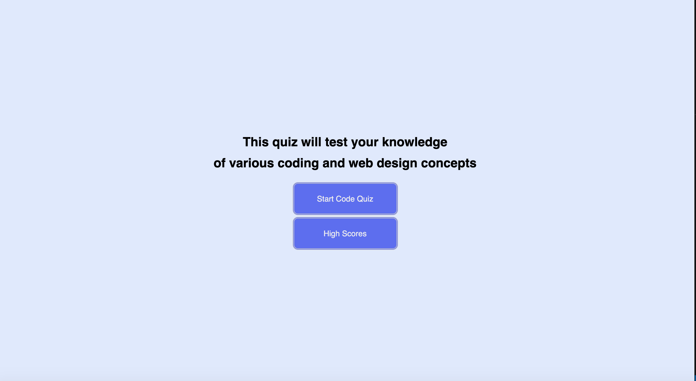

# Quiz
This is a fully operational quiz that is supported by javascript.  The style manipulation of the html was css derived.  This site, allows the user to interact with the interface by starting the timed quiz and answering questions as they follow the alerts.  The user then can log there score on a highscore page.

Above, we see the home page of the quiz.  There are two options.  One is to start the quiz.  This both triggers the first question to appear (hiding the original homepage) but also begins the timer for the quiz.

;
;

Here, we see the first question being displayed with four multiple choice options.  We then see in the second image down, when the correct answer is selected, an alert apeatse informing the user that they correctly answered the question.  After the alert is cleared the user is brought to the next question.

;
;
![fifth page] (image/FifthQuestion.png);

The last three questions are seen above.  Once the questions are all answered the user is brought to a page displaying there score.

;

Here the user can enter there name where it is then saved on the high score scree.

;
;

As can be seen above the user has the option to delete the high scores.  This deletes the scores from the cache memory on the browser all together.  This information is non-retrievable (for the most part).

The quiz can be taken again and again as many times as the user wants to enjoy the fun loving jokes that are these quiz questions.

RootMenu:

